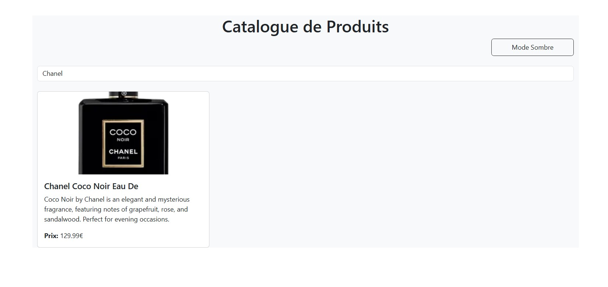
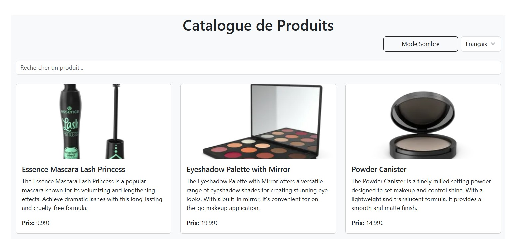
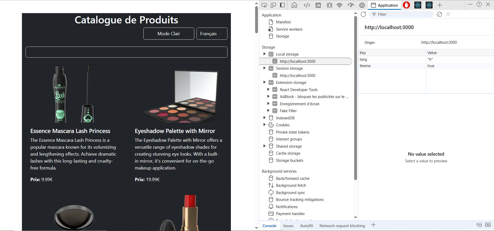
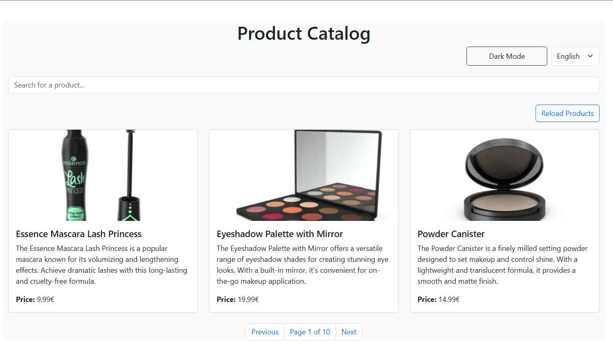

# TP React Hooks - Application de Gestion de Produits

Ce TP a pour objectif de mettre en pratique l'utilisation des Hooks React (useState, useEffect, useContext) ainsi que la création de Hooks personnalisés.

## Installation et configuration initiale

1. Cloner le dépôt :
```bash
git https://github.com/LAMBARAA-Abdellah/tp-react-hooks
cd tp-react-hooks
```

2. Créer votre propre dépôt sur Github et changer le remote :
```bash
# Supprimer le remote origine
git remote remove origin

# Ajouter votre nouveau remote
git remote add origin https://github.com/[votre-username]/tp-react-hooks.git

# Premier push
git push -u origin main
```

3. Installer les dépendances :
```bash
npm install
```

4. Lancer l'application :
```bash
npm start
```

## Instructions pour le TP

Pour chaque exercice :
1. Lisez attentivement l'énoncé
2. Implémentez la solution
3. Testez votre implémentation (pensez à faire des copies d'écran)
4. Mettez à jour la section correspondante dans ce README avec :
   - Une brève explication de votre solution
   - Des captures d'écran montrant le fonctionnement
   - Les difficultés rencontrées et comment vous les avez résolues
5. Commitez vos changements avec un message descriptif

### Exercice 1 : État et Effets 
#### Objectif : Implémenter une recherche en temps réel

- [ ] 1.1 Modifier le composant ProductSearch pour utiliser la recherche
- [ ] 1.2 Implémenter le debounce sur la recherche
- [ ] 1.3 Documenter votre solution ici

_Votre réponse pour l'exercice 1 :_
🎯 **Objectif** : Ajouter un champ de recherche en temps réel avec un effet debounce.

✅ **Ce que j’ai fait** :
- Utilisé `useState` pour stocker `searchTerm`
- Créé un hook `useDebounce` pour retarder la mise à jour
- Filtré les produits dans `useProductSearch`

📷 **Capture :**


---

### Exercice 2 : Context et Internationalisation
#### Objectif : Gérer les préférences de langue

- [ ] 2.1 Créer le LanguageContext
- [ ] 2.2 Ajouter le sélecteur de langue
- [ ] 2.3 Documenter votre solution ici


🎯 **Objectif** : Gérer la langue de l’interface (Français / Anglais).

✅ **Ce que j’ai fait** :
- Créé un `LanguageContext`
- Ajouté un sélecteur de langue dans le header
- Traduit dynamiquement les labels, boutons, titres et placeholders

📷 **Capture :**


---

### Exercice 3 : Hooks Personnalisés
#### Objectif : Créer des hooks réutilisables

- [ ] 3.1 Créer le hook useDebounce
- [ ] 3.2 Créer le hook useLocalStorage
- [ ] 3.3 Documenter votre solution ici

🎯 **Objectif** : Créer deux hooks personnalisés : `useDebounce` et `useLocalStorage`.

✅ **Ce que j’ai fait** :
- `useDebounce` : gère la recherche avec délai
- `useLocalStorage` : stocke la langue et le thème dans le navigateur

📷 **Capture :**


---

### Exercice 4 : Gestion Asynchrone et Pagination
#### Objectif : Gérer le chargement et la pagination

- [ ] 4.1 Ajouter le bouton de rechargement
- [ ] 4.2 Implémenter la pagination
- [ ] 4.3 Documenter votre solution ici

✅ **Ce que j’ai fait** :
- Créé un bouton pour recharger les produits
- Paginé les produits (3 par page)
- Réinitialisé la page à 1 automatiquement lors d’une nouvelle recherche

📷 **Capture :**


---

## Rendu

- Ajoutez l'URL de votre dépôt Github dans  **Classroom** et envoyer la réponse dès le démarage de votre projet.
- Les push doivent se faire au fûr et à mesure que vous avancez dans votre projet.
- Le README.md doit être à jour avec vos réponses et captures d'écran. 
- Chaques exercice doit faire l'objet d'au moins un commit avec un message mentionnant le numéro de l'exercice.
